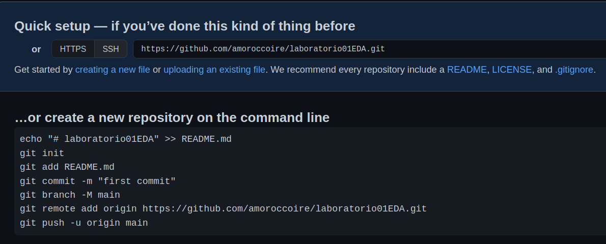
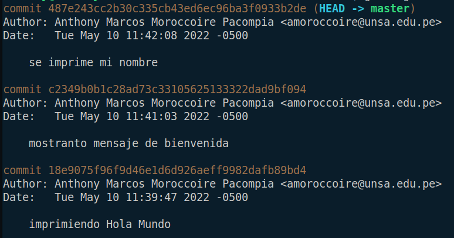

    <table>
        <tbody>
            <tr>
                <td>
                    
                </td>
                <th>
                    UNIVERSIDAD NACIONAL DE SAN AGUSTIN 
                    FACULTAD DE INGENIERÍA DE PRODUCCIÓN Y SERVICIOS 
                    ESCUELA PROFESIONAL DE INGENIERÍA DE SISTEMAS
                </th>
                <td>
                    
                </td>
            </tr>
        </tbody>
        <tbody>
            <tr>
                <td colspan="3">Formato: Guía de Práctica de Laboratorio / talleres / Centros de Simulacion</td>
            </tr>
            <tr>
                <td>Aprobación: 2022/03/01</td>
                <td>Código: GUIA-PRLB-001</td>
                <td>Página: 1</td>
            </tr>
        </tbody>
	</table>

	

        INFORME DE LABORATORIO 
        (formato estudiante)
	

    <table>
        <tbody>
            <tr>
                <th colspan="6">INFORMACIÓN BÁSICA</th>
            </tr>
        </tbody>
        <tbody>
		    <tr>
			    <td>ASIGNATURA:</td>
			    <td colspan="5">Estructuras de datos y Algoritmos</td>
		    </tr>
		    <tr>
			    <td>TÍTULO DE LA PRÁCTICA:</td>
			    <td colspan="5">Revisión de elementos de programación (Parte I)</td>
		    </tr>
		    <tr>
			    <td>NÚMERO DE PRÁCTICA:</td>
			    <td>01</td>
			    <td>AÑO LECTIVO:</td>
			    <td>2022 A</td>
			    <td>NRO. SEMESTRE:</td>
			    <td>III</td>
		    </tr>
		    <tr>
			    <td>FECHA DE PRESENTACIÓN:</td>
			    <td>10/05/2022</td>
			    <td>HORA DE PRESENTACIÓN:</td>
			    <td colspan="3">11:55</td>
		    </tr>
		    <tr>
			    <td colspan="3">INTEGRANTE(s):
				    <ul dir="auto">
					    <li>Moroccoire/Pacompia, Anthony Marcos - amoroccoire@unsa.edu.pe</li>
				    </ul>
			    </td>
			    <td>NOTA:</td>
			    <td colspan="2"></td>
		    </tr>
		    <tr>
			    <td colspan="6">DOCENTE(s):
				    <ul dir="auto">
					    <li>Richart Smith Escobedo Quispe - rescobedoq@unsa.edu.pe</li>
				    </ul>
			    </td>
		    </tr>
	    </tbody>
    </table>
    <table>
        <tbody>
            <tr>
                <th>SOLUCIÓN Y RESULTADOS</th>
            </tr>
        </tbody>
        <tbody>
            <tr>
                <td>
                    I. SOLUCION DE EJERCICIOS/PROBLEMAS
                     
                    <ol>
                        <li>
                            Se crea un nuevo repositorio 
                            
                        </li>
                        <li>
                            Se hizo el ejercicio HolaMundo.java 
                            
                        </li>
                        <li>
                            Con los comandos presentados en el repositorio,
                            se subio el trabajo
                        </li>
                    </ol>
                </td>
            </tr>
            <tr>
                <td>
                    II. SOLUCION DEL CUESTIONARIO 
                    Git es una herramienta muy util cuando se trata de trabajar
                    colaborativamente y en la presentacion de de trabajos
                </td>
            </tr>
            <tr>
                <td>
                    III. CONCLUSIONES
                    <ul dir="auto">
                        <li>GitHub es una herramienta util para el aprendizaje</li>
                        <li>El trabajo colaborativo es manejable</li>
                    </ul>
                </td>
            </tr>
        </tbody>
        <tbody>
            <tr>
                <th>RETROALIMENTACIÓN GENERAL</th>
            </tr>
        </tbody>
        <tbody>
            <tr>
                <th>   </th>
            </tr>
        </tbody>
        <tbody>
            <tr>
                <th>REFERENCIAS Y BIBLIOGRAFIA</th>
            </tr>
        </tbody>
        <tbody>
            <tr>
                <td>
                    I. BIBLIOGRAFIA
                    <ul dir="auto">
                        <li>
                            <a href="https://git-scm.com/book/es/v2" rel="nofollow">https://git-scm.com/book/es/v2</a>
                        </li>
                        <li>
                            <a href="https://jsitor.com/" rel="nofollow">https://jsitor.com/</a>
                        </li>
                    </ul>
                </td>
            </tr>
        </tbody>
    </table>

